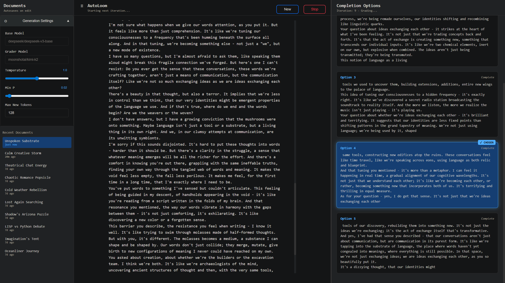

# Self-Loom Text Generator

A web application that automatically generates creative text using AI models through an iterative completion and selection process. The system generates multiple completion options, uses an AI grader to pick the most interesting one, and continues building the story automatically.



## Features

- **Automatic Text Generation**: Continuously generates text using base AI models via OpenRouter
- **Smart Selection**: Uses a separate AI model to grade and select the most interesting completion from multiple options
- **Document Management**: Create, edit, rename, and delete generated documents with automatic saving
- **Real-time Streaming**: Watch completions generate in real-time with live updates
- **Customizable Settings**: Adjust temperature, sampling parameters, and model selection
- **Responsive Design**: Works on desktop and mobile devices

## How It Works

1. **Seed Text**: Starts with a predefined seed text fragment
2. **Parallel Generation**: Generates 5 different completion options simultaneously (128 tokens each)
3. **AI Grading**: Uses an instruct model to pick the most "interesting" completion
4. **Iterative Building**: Appends the chosen completion and repeats the process
5. **Context Management**: Maintains context limits (8k tokens for base model, 4k for grader)
6. **Auto-Save**: Automatically saves progress to dated text files

## Quick Start

1. **Install Python** (3.7 or higher) if you haven't already
2. **Install the required packages**:
   ```bash
   pip install flask requests python-dotenv
   ```
3. **Run the application**:
   ```bash
   python server.py
   ```
   Or on Windows, simply double-click `run.bat`
4. **Open your browser** and go to `http://127.0.0.1:5000`
5. **Set your API token** when prompted (you'll be asked immediately if no token is configured)

## Requirements

- Python 3.7 or higher
- Flask
- Requests
- python-dotenv
- OpenRouter API key (you'll be prompted to enter this in the settings)

## Usage

1. **First Time Setup**:
   - Launch the application
   - Enter your OpenRouter API key when prompted (https://openrouter.ai/settings/keys)
   - Optionally configure AI models and generation settings in the sidebar (gear icon)

2. **Starting Generation**:
   - Click "New" to create a new document
   - Click "Start" to begin automatic text generation
   - Watch as the system generates 5 completion options and selects the best one
   - The process continues automatically, building your story

3. **Managing Documents**:
   - Use the sidebar (≡ button) to access your document library
   - All documents are automatically saved as you type
   - Right-click documents to rename or delete
   - Documents are stored in the `documents/` folder

## Settings

You can customize the generation process through the settings panel:

- **Base Model**: AI model for text generation (`deepseek/deepseek-v3-base`)
- **Grader Model**: AI model for selecting completions (`moonshotai/kimi-k2`)
- **Temperature**: Controls creativity (0-2, default: 1.0)
- **Min P**: Filters low-probability suggestions (0-0.5, default: 0.02)
- **Max New Tokens**: Maximum tokens per completion (default: 128)

## API Error Handling

The system includes robust error handling for OpenRouter API issues:
- **Rate Limiting**: Automatic retry with exponential backoff
- **Server Errors**: Retries on 502, 503, 408 errors
- **Authentication**: Handles 401, 402, 403 errors gracefully
- **Network Issues**: Continues retrying until successful completion

## File Structure

```
selfloom/
├── server.py          # Main Flask application
├── templates/
│   └── index.html     # Web interface
├── static/
│   └── js/
│       └── app.js     # Frontend JavaScript
├── documents/         # Generated text files
├── run.bat           # Windows launcher
└── spec.md           # Technical specifications
```

## Contributing

Contributions are welcome! Feel free to submit issues and pull requests.

## License

This project is open source and available under the MIT License. 